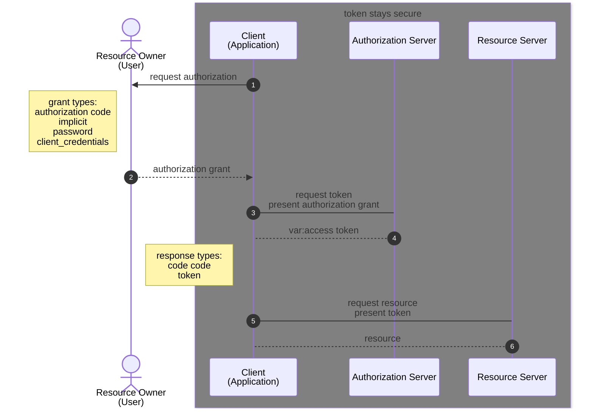

# UML in Markdowm
## Example
### Sequence Diagram

PlantUML

Mermaid

```mermaid
sequenceDiagram
    autonumber
    actor user as Resource Owner<br>(User)
    box Gray token stays secure
    participant client as Client<br>(Application)
    participant authorization as Authorization Server
    participant resource as Resource Server
    end
   
    client ->> user:request authorization
    Note left of user: grant types:<br>authorization code<br>implicit<br>password<br>client_credentials
    user -->> client:authorization grant

    client -> authorization:request token<br>present authorization grant
authorization --> client:var:access token
    Note right of user: response types:<br>code code<br>token

    client -> resource:request resource<br>present token
    resource --> client:resource
```
